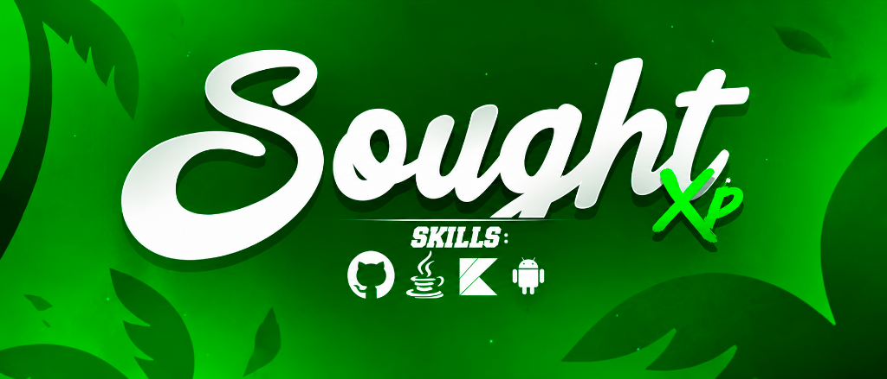

<p align="center">
  
</p>

<h3 align="center">Features</h3>

<p align="center">
  ☑ Channel/group cloning + topics<br>
  ☑ Media cloning (photos, videos, docs, stickers & voice)<br>
  ☑ Formatted text cloning<br>
  ☑ Filters (words, links, text & media)<br>
  ☑ Auto rate limit handling
</p>

## Installation

```bash
# Clone the repository
git clone https://github.com/SoughtXp/TGClonerX.git
cd TGClonerX

# Install dependencies
pip install -r requirements.txt

# Start the dashboard
python main.py
```

<p align="center">

$\color{red}\textsf{This project is for educational purposes only.}$

</p>
